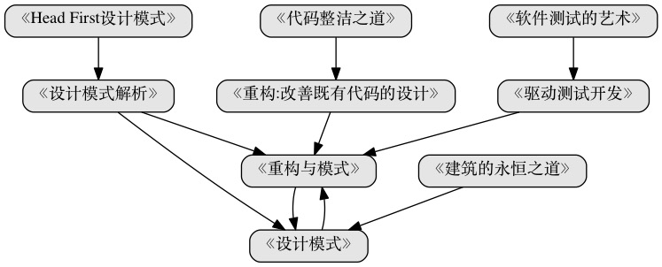
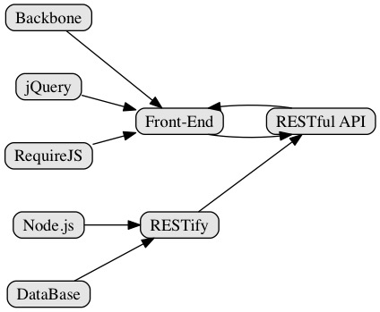

#Awesome Web Developer路线图

> Phodal's 阅读书单

``注意``:以下内容主要以个人的经验(开发 + 阅读的书目)为主导。适用于大、中小企业的Web开发，流程上可能不尽相同,但是大致适用。

##持续交付

- 《敏捷软件开发：原则、模式与实践》
- 《测试驱动开发:实战与模式解析》
- 《实现领域驱动设计》
- 《领域驱动设计：软件核心复杂性应对之道》
- 《敏捷武士：看敏捷高手交付卓越软件》

> 传统软件交付(一次交付)与Web，乃至现在的软件交付很大的一个不同点在于——持续交付。

当我们昨天、今天打开淘宝的时候，可能已经是不同两个版本的软件，而我们并没有察觉出来。而这个软件可能是前天、上星期写好的，如果是上上个月写好的，那么就说明阿里的软件发布模式是有问题的。

这依赖于自动化测试、版本管理、自动部署等等，领域知识或者领域模式已经是经过市场充分验证了。

而在我们开发阶段要做的就是测试(TDD)、修复bug、交付功能等等。

而在部署以后则是性能等等。

###《持续交付:发布可靠软件的系统方法》

在这本书里面介绍了如何构建一座大桥——书的封面。作为一本Jolt大奖的作品，里面详细的说明

 - 如何持续的交付软件
 - 如何发布可靠软件的系统方法

书中可以详细了解如何交付一个软件: 

从频繁提交代码、自动化测试(保证测试覆盖) -> 运行本地测试 -> 服务器运行测试 -> 部署到测试环境 -> 交付管理

而这些都应该是自动的，所以你需要知道的东西有: 如何编写测试(Junit、Qunit、BDD、TDD..)、自动化测试(Selenium..)、版本管理(git)、配置(feature toggle)、依赖管理、部署脚本等等。

(ps:上面括号里面的不在书的范围内。)

##编程技能成长路线

- 《重构与模式》
- 《代码整洁之道》
- 《重构:改善既有代码的设计》

##JavaScript

- 《编写可维护的JavaScript》
- 《JavaScript设计模式》
- 《EffectiveJavaScript:编写高质量JavaScript代码的68个有效方法》
- 《JavaScript语言精粹》

###JavaScript Application Example

##Web杂项
- 《实用负载均衡技术:网站性能优化攻略》
- 《网站性能监测与优化》
- 《构建高性能Web站点》
- 《SEO艺术》

##Others
- 《架构之美》
- 《Vim实用技巧》
- 《互联网思维的企业》
- 《Rework》
- 《胡林的儿女》

[待我代码编成，娶你为妻可好](http://www.xuntayizhan.com/person/ji-ke-ai-qing-zhi-er-shi-dai-wo-dai-ma-bian-cheng-qu-ni-wei-qi-ke-hao-wan/)
