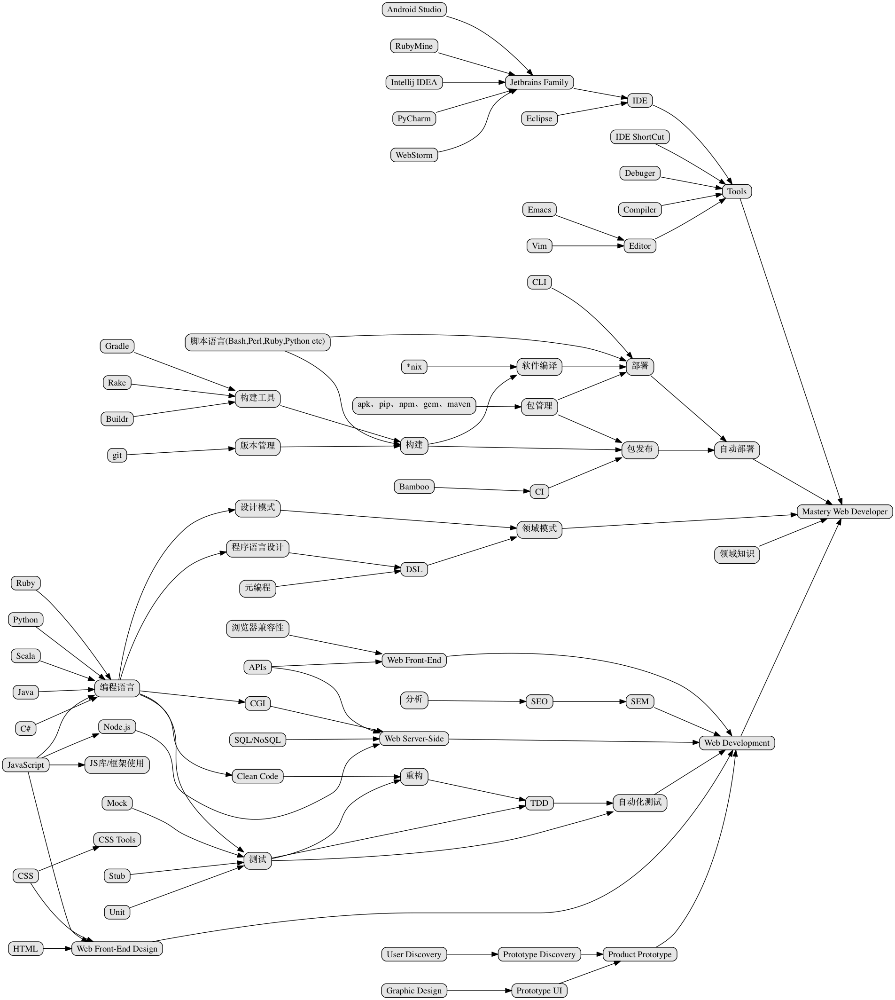
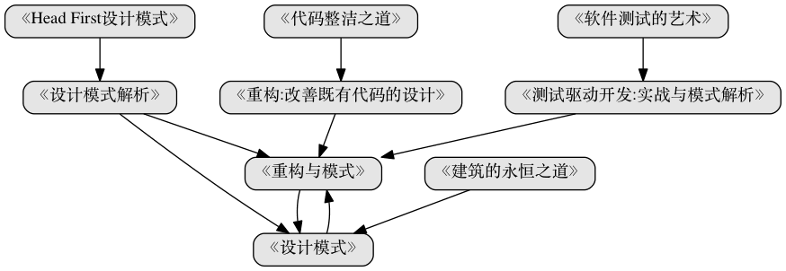
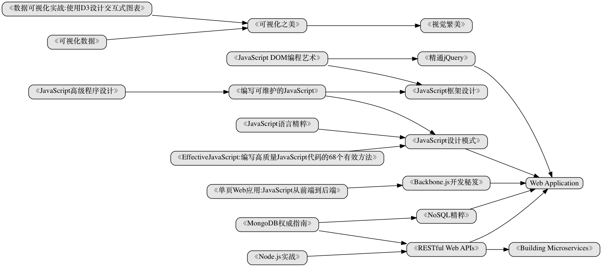
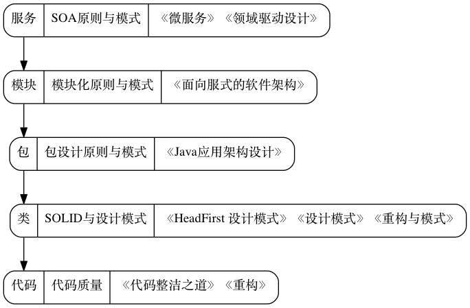
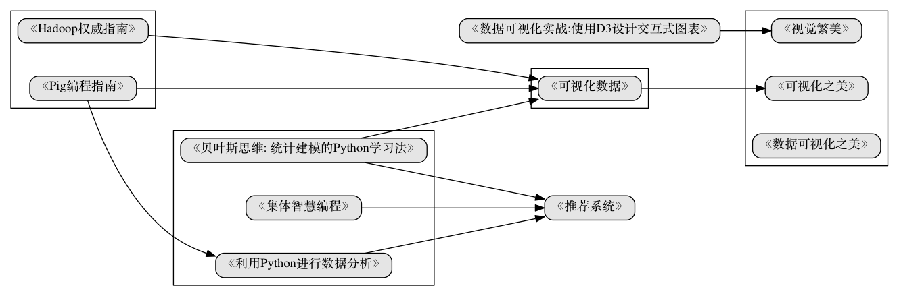

#Web Developer学习路线图

##持续交付

- 《敏捷软件开发：原则、模式与实践》
- 《测试驱动开发:实战与模式解析》
- 《实现领域驱动设计》
- 《领域驱动设计：软件核心复杂性应对之道》
- 《敏捷武士：看敏捷高手交付卓越软件》

##编程技能成长路线

- 《重构与模式》
- 《代码整洁之道》
- 《重构:改善既有代码的设计》

##JavaScript读书路线

- 《编写可维护的JavaScript》
- 《JavaScript设计模式》
- 《EffectiveJavaScript:编写高质量JavaScript代码的68个有效方法》
- 《JavaScript语言精粹》

###JavaScript Application Example

##Web杂项
- 《实用负载均衡技术:网站性能优化攻略》
- 《网站性能监测与优化》
- 《构建高性能Web站点》
- 《SEO艺术》

###架构学习路线

- 《架构之美》
- 《面向模式的软件架构》(1,4)
- 《软件框架设计的艺术》
- 《程序员必读之软件架构》
- 《架构实战：软件架构设计的过程》

##机器学习读书路线

- 《贝叶斯思维: 统计建模的Python学习法》
- 《利用Python进行数据分析》
- 《Python自然语言处理》
- 《机器学习: 实用案例分析》
- 《驾驭文本:文本的发现、组织和处理》

## License

© 2015 [Phodal Huang](http://www.phodal.com). This code is distributed under the MIT license. See `LICENSE.txt` in this directory.

[待我代码编成，娶你为妻可好](http://www.xuntayizhan.com/person/ji-ke-ai-qing-zhi-er-shi-dai-wo-dai-ma-bian-cheng-qu-ni-wei-qi-ke-hao-wan/)
